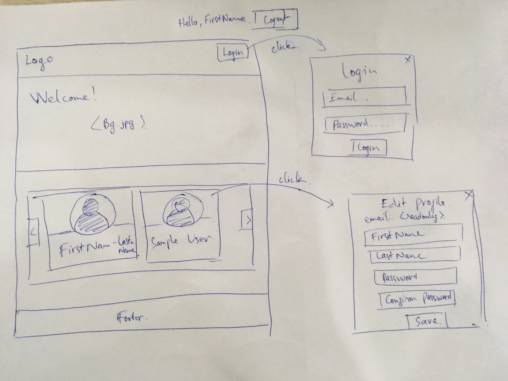

# Frontend Web Development Practices
This repo holding basic practices test for frontend devs

## TEST-1: Basic `HTML/CSS/JS + Bootstrap`

Technology requirements:
- HTML5
- CSS3
- Javascript
- Libraries: Bootstrap (version 4.x), JQuery, JQuery UI